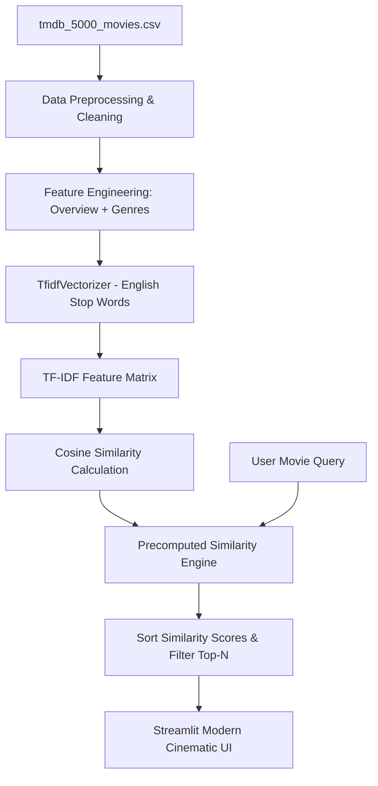

# 🎬 CineMatch — AI Movie Recommendation System

[](https://movie-recommendation-system-hejeg8p3u4tyfp9rvnst77.streamlit.app)
[](https://www.python.org/)
[](https://scikit-learn.org/)
[](https://pandas.pydata.org/)
[](LICENSE)

> An intelligent content-based movie recommendation web application built with **Streamlit**, **NLP (TF-IDF Vectorization)**, and **Cosine Similarity**, trained on the **TMDB 5000 Movies Dataset**.

🌐 **Live Web Application:** [movie-recommendation-system.streamlit.app](https://movie-recommendation-system-hejeg8p3u4tyfp9rvnst77.streamlit.app)

---

## 🌟 Key Features

- 🔍 **Smart Autocomplete Search**: Instantly search across 4,800+ movies in an alphabetical dropdown list without needing exact keyword matching.
- 🎯 **Similarity Score Matching**: View quantitative match percentages (e.g. `🎯 94.2% Match`) for every recommendation.
- 🎬 **Selected Movie Spotlight**: Live preview card displaying the selected movie's rating ⭐, release year 📅, tagline, genre badges, and plot overview.
- 🖼️ **Optional TMDB Poster Art Integration**: Enter an optional TMDB API key in the sidebar to fetch official high-resolution poster artwork live.
- 🎲 **Surprise Me! Picker**: Discover new movies randomly with a single click.
- 🎨 **Cinematic Glassmorphism UI**: Custom CSS theme with dark slate tones, glowing accent cards, rating badges, and responsive grid layouts.

---

## 📐 Technical Architecture & Workflow



---

## 🧠 How The Algorithm Works

### 1. Feature Combination & Tokenization
The recommendation engine extracts textual features by combining the plot overview and movie genres for each entry:
$$\text{Document Vector Text} = \text{Overview} + \text{" "} + \text{Genres}$$

### 2. TF-IDF Vectorization
The **Term Frequency-Inverse Document Frequency (TF-IDF)** converts text into numerical feature vectors while penalizing common non-informative words:
$$\text{TF-IDF}(t, d, D) = \text{TF}(t, d) \times \text{IDF}(t, D)$$

Where:
- $\text{TF}(t, d)$: Frequency of term $t$ in movie overview/genre document $d$.
- $\text{IDF}(t, D) = \log\left(\frac{N}{|\{d \in D : t \in d\}|}\right)$: Inverse document frequency across all $N$ movies.

### 3. Cosine Similarity Score
The similarity between the input movie vector $\mathbf{A}$ and all candidate movie vectors $\mathbf{B}$ is calculated using the dot product normalized by vector magnitudes:

$$\text{Cosine Similarity}(\mathbf{A}, \mathbf{B}) = \frac{\mathbf{A} \cdot \mathbf{B}}{\|\mathbf{A}\| \|\mathbf{B}\|} = \frac{\sum_{i=1}^{n} A_i B_i}{\sqrt{\sum_{i=1}^{n} A_i^2} \sqrt{\sum_{i=1}^{n} B_i^2}}$$

The result ranges from `0.0` (completely different) to `1.0` (identical content), which is converted into a user-friendly match percentage.

---

## 📂 Project Structure

```
movie-recommendation-system/
├── app.py                         # Streamlit web application & UI engine
├── tmdb_5000_movies.csv           # TMDB dataset containing ~4,800 movie records
├── movie_recommender_system.ipynb # Data exploration & prototyping notebook
├── requirements.txt               # Dependencies (streamlit, scikit-learn, etc.)
└── README.md                      # Comprehensive project documentation
```

---

## ⚡ Quick Start & Installation

### Prerequisites
- Python 3.8 or higher installed on your system.

### Step 1: Clone the Repository
```bash
git clone https://github.com/milanjyotiray/movie-recommendation-system.git
cd movie-recommendation-system
```

### Step 2: Install Dependencies
```bash
pip install -r requirements.txt
```

### Step 3: Launch the Streamlit Web App
```bash
streamlit run app.py
```

The web application will launch locally at `http://localhost:8501`.

---

## 📊 Dataset Information

- **Source:** [Kaggle TMDB 5000 Movie Dataset](https://www.kaggle.com/datasets/tmdb/tmdb-movie-metadata)
- **Record Count:** ~4,803 Movies
- **Key Columns Used:** `id`, `title`, `overview`, `genres`, `vote_average`, `vote_count`, `release_date`, `tagline`, `popularity`.

---

## 🔮 Future Enhancements

- 🤖 **Hybrid Recommender Engine**: Integrate Collaborative Filtering (User-User / Item-Item matrix factorization) alongside Content-Based filtering.
- 💬 **Sentiment & Keyword Embeddings**: Upgrade text representations using Transformer embeddings (BERT / Sentence-Transformers).
- 🎬 **Trailer & Actor Information**: Include YouTube trailer embeds and director/cast information.

---

## 👤 Author

**Milanjyoti Ray**  
*BS Data Science & Applications, IIT Madras*  

- 💻 GitHub: [@milanjyotiray](https://github.com/milanjyotiray)  
- 💼 LinkedIn: [milanjyotiray](https://linkedin.com/in/milanjyotiray)

---

<p align="center">
  <sub>Made with ❤️ using Streamlit & Scikit-Learn</sub>
</p>
